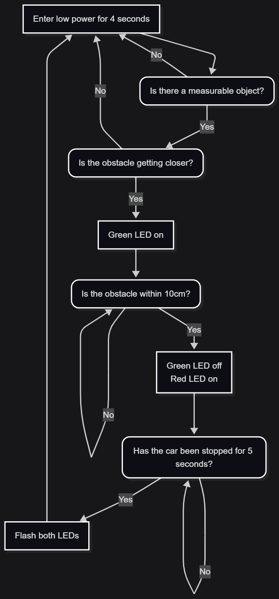
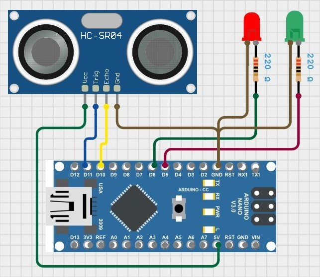

# Parking Sensor

This project outlines the sensor I developed to help me park my car. My apartment parking spot is tight, and I have to get really close to the wall to not stick out.
Every now and then, I inevitably touch the wall with the front of my car. Never enough to do damage, but I'd rather not keep doing it.

I developed this sensor to solve this issue. It sticks to the wall and uses an ultrasonic sensor to measure the distance from the sensor to the front of my car.
When I get close enough to the wall that my car is no longer protruding from the back of the parking spot, the sensor alerts me to stop.

## Functionality

The flow of the parking sensor logic is demonstrated in the flowchart below. Ultrasonic distance measurements are low-pass filtered using a cutoff frequency of 50Hz to reject high-frequency noise.

## Circuit Diagram

Could this problem have been solved by sticking something soft to the wall? Sure, but where's the fun in that?
